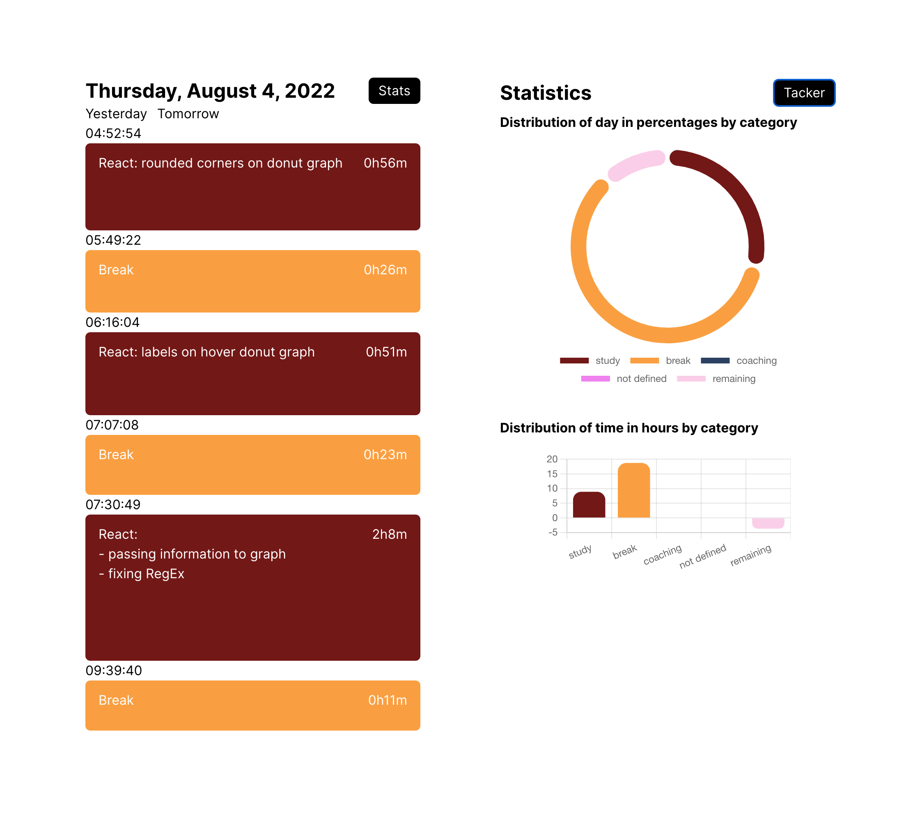

# # Tacker App

This is a time tracking application built in React that helps users identify where are they spending their time.

See the live application at https://juan-jose-toro.github.io/Tracker/

## Functionalities

- **Time Tracking:** User can track their time by creating intervals that record the time spent on the current task which can be defined in the activity description field inside each interval

- **Tag System:** User can define keywords in the settings menu to classify their intervals by categories

- **Stats interface:** Based on the categories defined and the time spent on categories defined in the tag system, the user can review on which category they have spent the most time on

- **Calendar functionality:** Users can browse to previous days and review their time spending

## Installation

Once the project has been downloaded run `npm start` to run the project on http://localhost:3000/
